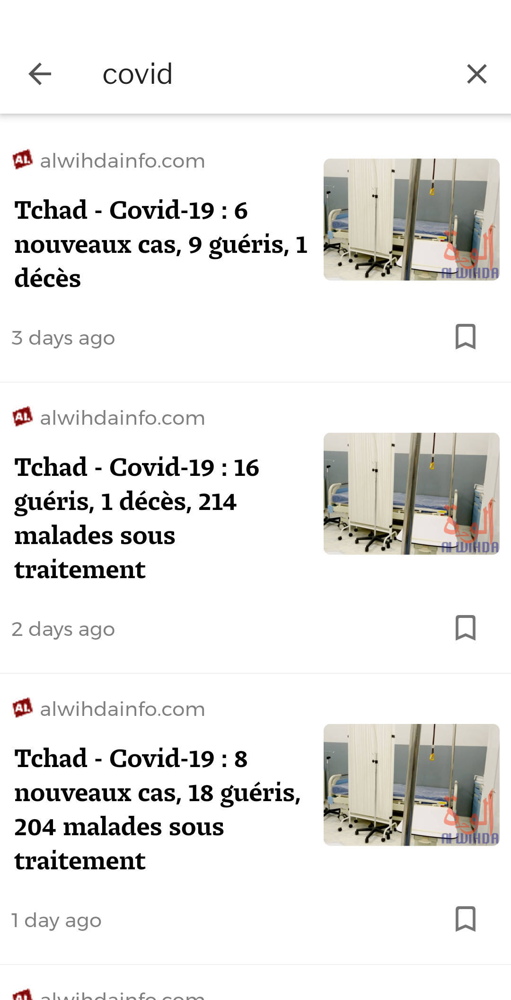
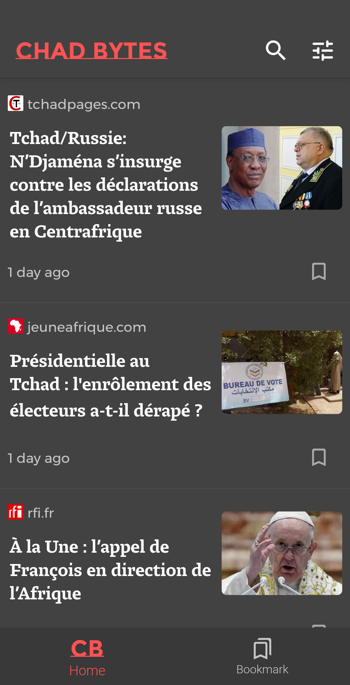
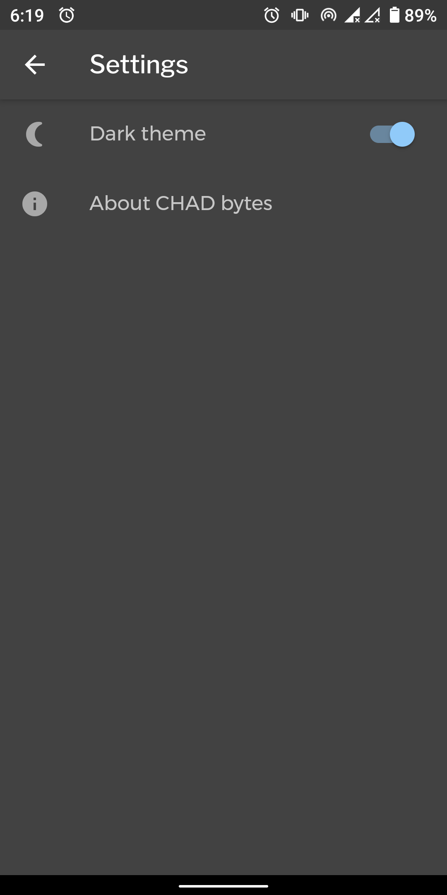

# ChadBytes

Application Android qui présente les actualités sur le Tchad sur un fil d'actualités. Les actualités sont collectées sur differents sites d'informations par un programme écrit en Golang et déployé sur IBM Cloud Foundry.

# Screenshots

    

      
    &nbsp;
      
    &nbsp;
      
    

    

      
    &nbsp;
      
    &nbsp;

# Privacy statement
Cette application ne collecte pas, n'utilise pas et ne partage pas les données personnelles de l'utilisateur ou les informations sur les appareils qui l'installe.

This app does not collect, use, or share user data or device data.

[Télécharger l'application android Chad Bytes](https://drive.google.com/file/d/1CHyjYUWcWSTEkYwVgiTeR4DZ09pNvUni/view?usp=sharing)
