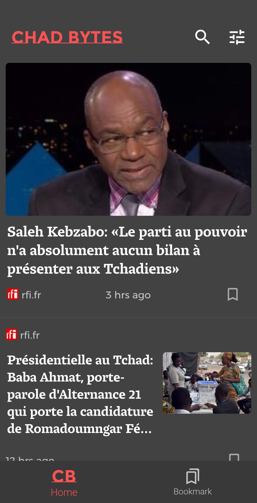

# ChadBytes

Application Android qui présente les actualités sur le Tchad sur un fil d'actualités. Les actualités sont collectées sur differents sites d'informations par un programme écrit en Golang et déployé sur IBM Cloud Foundry.

[Télécharger l'application android Chad Bytes](https://drive.google.com/drive)
